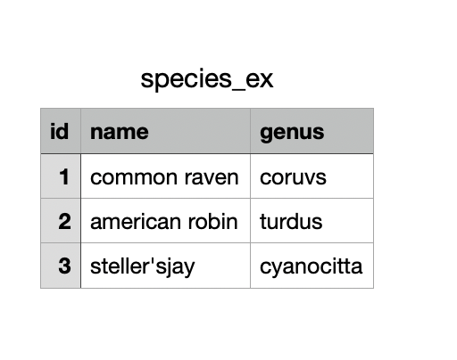
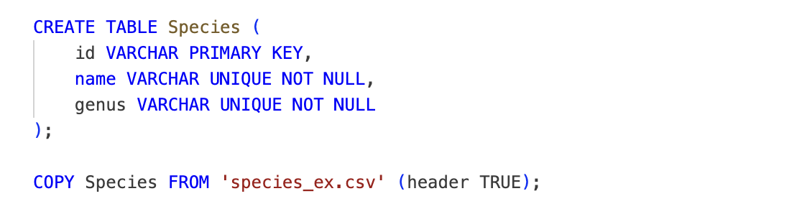
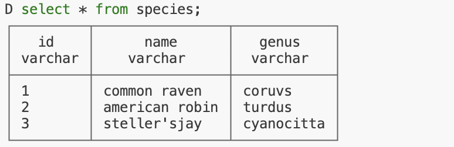
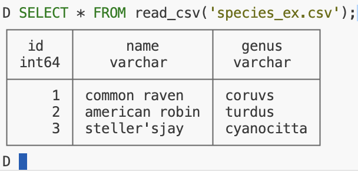

##  {#title-slide data-menu-title="Title Slide" background="#cad2c5"}

[EDS 213: Lab 3]{.custom-title}

[Ingesting your data into a database]{.custom-subtitle}

##  {#Database-Ingestion-Options data-menu-title="Database Ingestion Options"}

[Database Ingestion Options]{.slide-title}

-   Many different ways to ingest your data into a database!
-   We are going to cover two options and note their differences
-   We will use the following example csv file
-   

##  {#Option1 data-menu-title="Option # 1"}

[Option #1: COPY]{.slide-title}

::: {fragment}
-   
:::

##  {#Option1-characteristics data-menu-title="Option # 1 Characteristics"}

**Option 1 Key characteristics:**

-   Fast and efficient for large files
-   Requires the table to already exist with matching column names and types
-   You control the schema explicitly — data types, constraints, etc.

##  {#Option2 data-menu-title="Option # 2"}

[Option #2: read_csv]{.slide-title}

-   

##  {#Option2-characteristics data-menu-title="Option # 2 Characteristics"}

**Option 2 Key characteristics:**

-   Convenient — no need to define the schema upfront
-   Automatically infers column types from the data
-   Great for quick exploration and prototyping
-   Type inference can sometimes get things wrong — always verify!

## The Difference

| | `COPY` | `read_csv` |
|---|---|---|
| Schema definition | Manual (you write it) | Automatic (inferred) |
| Type control | Full control | Inferred — may need correction |
| Speed | Very fast for large data | Fast, slightly more overhead |
| Best for | Production ingestion | Exploration & prototyping |
