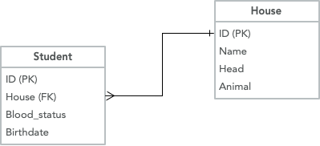

**Please use Canvas to return the assignments: <https://ucsb.instructure.com/courses/32934/assignments/459588>**

Create an ER (entity-relationship) diagram for the Harry Potter tables shown in class.  It will be helpful to refer back to the [slides](slides-01.pptx).

Requirements:

-   Your diagram should include Student, House, Wand, Course, and Enrollment tables.
-   Each table should list the name of the entity and the entity's attributes.
-   Indicate which attribute(s) form the primary key, if there is one for that table.
-   A foreign key relationship from an attribute in one table to an attribute in another table should be indicated by a line between the two attributes. The ends of the lines should reflect the cardinalities at each end. See the example below.

**Twist #1!** The slides shown in class (e.g., slide 32) demonstrated a many-to-one relationship between wands and students, i.e., one student might own multiple wands, but any given wand has only one owner. However, for this exercise, you are being asked to model a many-to-many relationship between wands and students (it happened in the books that the same wand was used by different students, though at different times, of course). To create a many-to-many relationship, you will need to invent an intermediate table that represents the student-wand ownership relation, in the same way the Enrollment table intermediates between the Student and Course tables.

**Twist #2!** You must also store the date range (i.e., begin date and end date) of wand ownership. You will need to think where these date attributes belong. Are they attributes of a student? Of a wand? Of something else?

Various symbologies have been developed for ER diagrams. For this assignment, represent the "one" side of a many-to-one relationship by a single vertical bar, and represent the "many" side by a so-called crow's foot. In the end, your diagram should have this visual appearance:

{fig-alt="Sample ER diagram showing desired visual style"}

You can use a tool like [dbdiagram.io](https://dbdiagram.io) or any other drawing tool. But honestly, it will be fastest, and it will be perfectly be fine, if you just draw it by hand and take a picture with your phone.

**Credit: 40pts**
