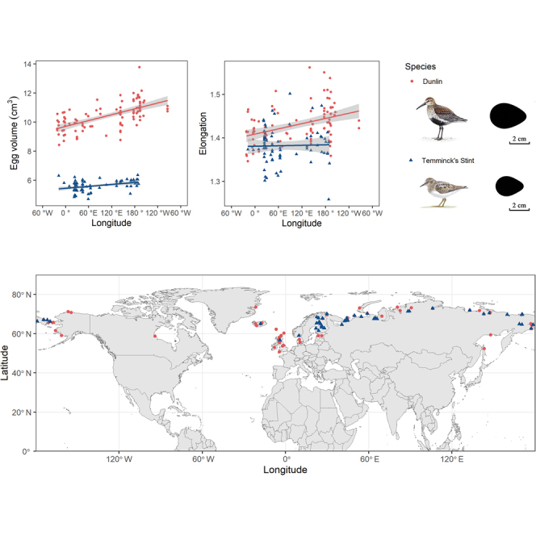

**Please use Canvas to return the assignments: <https://ucsb.instructure.com/courses/32934/assignments/473365>**

Liu _et al_ found an interesting result, that characteristics of the eggs of certain Arctic shorebird species exhibit linear variation as a function of longitude (that's **longitude**, not latitude) [^1]:

[^1]: Liu J, Chai Z, Wang H, Ivanov A, Kubelka V, Freckleton R, Zhang Z, Székely T. "Egg characteristics vary longitudinally in Arctic shorebirds." iScience 26(6):106928 (2023 May 19). <https://doi.org/10.1016/j.isci.2023.106928>



Why might that be?  The authors surmise,

> The longitudinal pattern of egg characteristics might be influenced by climatic factors in the circumpolar area or it might be affected by female body size. Eggs closer to the western side of Eurasia are smaller, less elongated and less pointed, whereas eggs closer to the eastern side are the opposite. [...] Because oceanic climate also varies along longitudinal gradients in the Arctic area, the local precipitation and temperature likely impact food availability via phenology and affect reproductive effort for females during incubation and hence on egg characteristics.

Our ASDN database has data for the first of their study species, the Dunlin (Calidris alpina).  While the ASDN project studied eggs in a different hemisphere (northern Canada as opposed to Eurasia), nevertheless we can ask ourselves, does our data exhibit the same trends?

For this problem, you will be:

- looking at egg volume as a function of longitude,
- performing a linear regression, and
- reporting the slope and Pearson correlation coefficient of that regression.

To do so you will need to load a larger set of nest and egg data from CSV files into new tables, and use some statistics functions provided by DuckDB to do the regression.

- Step 1.  Open the ASDN database we have been using all along, `database.duckdb`.  In this database, load `nests_big.csv` into a table `nests_big` using

  `CREATE TABLE nests_big AS SELECT * FROM 'nests_big.csv';`
  
  Similarly load `eggs_big.csv` into a table `eggs_big`.  Get a sense of what's in these tables by looking at how many rows they have, what columns they have, and what some sample rows look like.  Also look at the table definitions that DuckDB created automatically.
  
- Step 2.  To be able to relate egg measurements to species and sites you will need to perform some relational joins.  To start with, perform a 3-way join between `eggs_big`, `nests_big`, and `Species`.  To do so, know that any number of tables can be joined in one statement simply by listing the tables and join conditions in order, as in:

  ```
  SELECT * FROM eggs_big
    JOIN nests_big USING ...
    JOIN Species ON ...
    JOIN some_other_table ON ...
  ```

  Add a WHERE clause to your query to select the eggs for species Calidris alpina only.  You should wind up with a table that has 2912 rows and 10 columns and that looks something like this:

  ```
  D SELECT * FROM ...
  ┌───────────────────┬─────────┬────────┬───┬─────────────────┬───────────────┐
  │      Nest_ID      │ Egg_num │ Length │ … │ Scientific_name │   Relevance   │
  │      varchar      │  int64  │ double │   │     varchar     │    varchar    │
  ├───────────────────┼─────────┼────────┼───┼─────────────────┼───────────────┤
  │ 03barrdunl012     │       1 │   36.1 │ … │ Calidris alpina │ Study species │
  │ 03barrdunl012     │       2 │   34.6 │ … │ Calidris alpina │ Study species │
  │ 03barrdunl012     │       3 │   35.5 │ … │ Calidris alpina │ Study species │
  │ 03barrdunl012     │       4 │   36.3 │ … │ Calidris alpina │ Study species │
  ```

- Step 3. Let's start narrowing down columns.  For now, revise your query to select just the Site column and compute an egg volume column, as before using the formula

  $${\pi \over 6} W^2 L$$

  where $W$ is the egg width and $L$ is the egg length and using 3.14 for $\pi$.  Your table should still have 2912 rows and should now look something like:

  ```
  ┌─────────┬────────────────────┐
  │  Site   │       Volume       │
  │ varchar │       double       │
  ├─────────┼────────────────────┤
  │ barr    │ 12575.492760000001 │
  │ barr    │        12620.08704 │
  │ barr    │  9827.938333333334 │
  │ barr    │          10049.413 │
  ```

- Step 4.  You're getting close.  To perform the linear regression you will need a table with two columns, Longitude and Volume.  To replace the Site column above with Longitude will require another join.  Revise your query to add a fourth (!) join with the Site table.  Uh oh, both the Species table and Site tables have columns named Code.  You will need to prefix column names with table names to disambiguate.  If all goes well, you should wind up with a table looking like this:

  ```
  ┌───────────┬────────────────────┐
  │ Longitude │       Volume       │
  │   float   │       double       │
  ├───────────┼────────────────────┤
  │    -156.6 │ 12575.492760000001 │
  │    -156.6 │        12620.08704 │
  │    -156.6 │  9827.938333333334 │
  │    -156.6 │          10049.413 │
  ```

- Step 5. Deal with a numeric bugaboo.  If you look at the minimum and maximum values of longitude in the Site table, you will see that they range from -164.9 to 170.6.  But in this case, the correct interpretation of a positive longitude is really that it is to the west of the +/-180 meridian, i.e., it is even more negative than -180.  In other words, if a longitude $l$ is positive, it should be replaced by $l-360$, but if it is negative, it can be left as is.  Use a CASE statement to express this.  Modify your query yet again so that it resembles:

  `SELECT CASE WHEN ... THEN ... ELSE ... END AS Longitude, ...`

- Step 6. At this point, stop to admire your accomplishment; you're ready for the analysis.  Save your table as a view or temporary table (your choice).

- Step 7. DuckDB provides many, many functions, including many statistics functions.  Use the `regr_slope` and `corr` functions to compute the linear regression slope and Pearson correlation coefficient.  For both these functions, Volume is the dependent variable and Longitude is the independent variable.  You should wind up with:

  ```
  ┌────────────────────┬──────────────────────┐
  │       Slope        │         PCC          │
  │       double       │        double        │
  ├────────────────────┼──────────────────────┤
  │ -4.820618973105421 │ -0.10814179258398778 │
  └────────────────────┴──────────────────────┘
  ```

## Part 1 (50pts)

Please submit your SQL for the above.

## Part 2 (10pts)

Answer the following questions.

1. Do the tables created automatically by DuckDB guarantee that a nest ID mentioned in the `eggs_big` table actually exists in the `nests_big` table?  If yes, explain how that is guaranteed, if not, explain why not. **(6pts)**

2. What queries did you use (or could you use) to find the minimum and maximum longitude values in the Site table? **(2pts)**

3. The interpretation of the Pearson correlation coefficient is: +1 is a perfect positive correlation, -1 is a perfect negative correlation, and 0 is no correlation at all.  How would you characterize the correlation between egg volume and longitude for the eggs of Calidris alpina in the Arctic above Canada? **(2pts)**