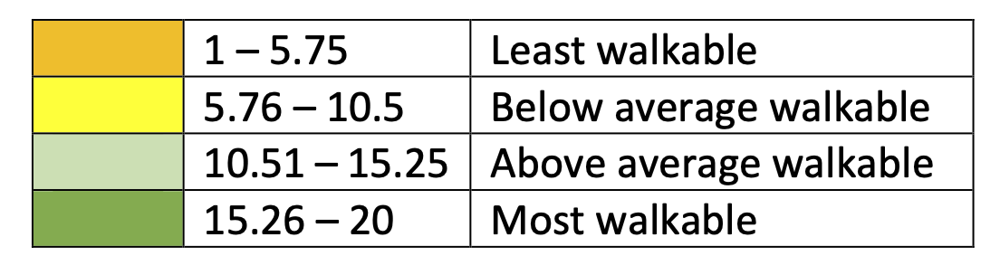
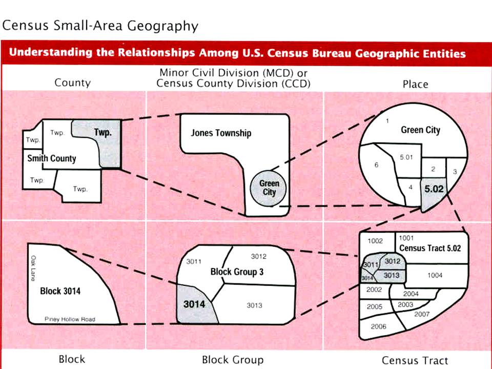

## The National walkability index


The National **Walkability Index** is a nationwide geographic data resource that ranks block groups according to their relative walkability. The national dataset includes walkability scores for all US Census block groups as well as the underlying attributes that are used to rank the block groups.

The index was developed using selected variables on density, diversity of land uses, and proximity to transit from the Smart Location Database. 

Here is the user guide of this index: <https://www.epa.gov/sites/default/files/2021-06/documents/national_walkability_index_methodology_and_user_guide_june2021.pdf>

The index range from 1 to 20, where 1 is the least walkable and 20 the most walkable.

Here are four main categories:

- Least walkable: 1 -5.75
- Below average: 5.76 - 10.5
- Above average: 10.51 - 15.25
- Most walkable: 15.26 - 20

{fig-alt="Walkability index scale"}
### US Census geometries

{fig-alt="Structure and nesting of the various US Census gemotries"}


## Data Analysis

From your database folder in the bren-eds213-data repository, run:

```bash
duckb -ui walkability.duck.db
```

What did just happened?!


To conduct our analysis we are going to use the `spatial` and `httfs` DuckDB extensions:

```sql
-- INSTALL spatial;
LOAD spatial;
-- INSTALL httpfs;
LOAD httpfs;
```

Let's see how fast we can import those data from parquet for the Santa Barabara county:

```sql
SELECT GEOID10, STATEFP, COUNTYFP, TRACTCE, BLKGRPCE, CBSA, CBSA_Name, TotPop, NatWalkInd, geometry
  FROM read_parquet('/courses/EDS213/data/walkability/walkability_hive/**/*.parquet', hive_partitioning=true)
  WHERE STATEFP = '06' AND COUNTYFP = '083';
```

OK before we bet started in doing analaysis, we can store those data as a View:
 
```sql
CREATE VIEW SB_data AS (
  SELECT GEOID10, STATEFP, COUNTYFP, TRACTCE, BLKGRPCE, CBSA, CBSA_Name, TotPop, NatWalkInd, geometry
  FROM read_parquet('/courses/EDS213/data/walkability/walkability_hive/**/*.parquet', hive_partitioning=true)
  WHERE STATEFP = '06' AND COUNTYFP = '083'
  );
```


Let's compute the average walkbility index per Census tract: 

```sql
SELECT
  TRACTCE,
  COUNT(*) AS Block_count,
  AVG(NatWalkInd) AS Walk_ind_avg
FROM SB_data
GROUP BY TRACTCE
ORDER BY Walk_ind_avg DESC;


-- actually since we have the geometry information, we can also compute the average area of teh blocks within a specific tract:
-- We need first to install and load the spatial extension of DuckDB:

SELECT
  TRACTCE,
  COUNT(*) AS Block_count,
  AVG(ST_Area(geometry)) AS Avg_area,
  AVG(NatWalkInd) AS Walk_ind_avg
FROM SB_data
GROUP BY TRACTCE
ORDER BY Walk_ind_avg DESC;
```

We could also read the data via a web server!!

```sql
--- Try remote
-- Let's select the data for Santa Barbara County and subset only a few columns;
SELECT GEOID10, STATEFP, COUNTYFP, TRACTCE, BLKGRPCE, CBSA, CBSA_Name, TotPop, NatWalkInd FROM read_parquet('https://apps.bren.ucsb.edu/eds213-data/walkability/walkability_wgs84.parquet')
WHERE STATEFP = '06' AND COUNTYFP = '083';
```

## Dataset preparation 

The walkability index came as an ESRI geodatabase. The spatial extension can directly read this file format:

```sql
-- INSTALL spatial;
LOAD spatial;
-- INSTALL httpfs;
LOAD httpfs;

-- Let's have a look at the data
SELECT * FROM ST_Read(Natl_WI.gdb) LIMIT 10;


-- Save it as a table
DROP TABLE walk84;
CREATE TABLE walk84 AS (
  SELECT * EXCLUDE (Shape),
  Shape AS geometry,
  ST_Hilbert(
    Shape, 
    ST_Extent(ST_MakeEnvelope(-125.00, 24.39, -66.93, 49.38))
        ) AS bbox_geom
  FROM ST_Read(Natl_WI.gdb)
  ORDER BY bbox_geom
  );
  
  
-- See if the table looks good
SELECT * FROM walk84 LIMIT 10;


--- Export to one large parquet file
COPY walk84 TO 'walkability_wgs84.parquet' (FORMAT parquet);

-- Export to parquet files using hive partitioning on state and county FIPS
COPY(
    SELECT * 
    FROM walk84
    ) 
TO 'walkability_hive' 
(FORMAT 'parquet', COMPRESSION 'zstd', PARTITION_BY (STATEFP, COUNTYFP));

-- Let's try an analysis: Let's compute the number of block and their average area per tract for the states of CA, NV, OR, WA 
-- Sate FIPS: https://www.bls.gov/respondents/mwr/electronic-data-interchange/appendix-d-usps-state-abbreviations-and-fips-codes.htm
-- Adapted from https://medium.com/center-for-coastal-climate-resilience-visualizatio/optimal-geoparquet-partitioning-strategy-33331874ef6c

SELECT
  STATEFP,
  TRACTCE,
  COUNT(*) AS block_count,
  AVG(ST_Area(geometry)) AS avg_area
FROM walk84
WHERE STATEFP IN ('06', '32', '41', '53')
GROUP BY TRACTCE, STATEFP
ORDER BY block_count DESC;
```

