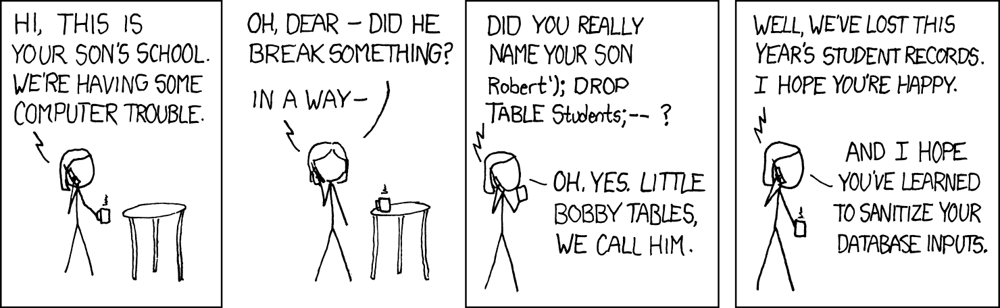

**Please use Canvas to return the assignments: <https://ucsb.instructure.com/courses/26293/assignments/361496>**

In class we demonstrated how to parameterize a query and then insert values for the parameter(s):

```         
query_template = "SELECT ... WHERE Species = ? AND ageMethod = ?"
species = "wolv"
age_method = "float"
cur.execute(query_template, [species, age_method])
```

The bare question marks in the template are placeholders. The database driver substitutes the supplied parameter values before submitting the query to the database, adding any quoting and character escaping as necessary.

You may decide you want to use your own Python string substitution instead:

```         
query_template = "SELECT ... WHERE Species = '%s' AND ageMethod = '%s'"
species = "wolv"
age_method = "float"
cur.execute(query_template % (species, age_method))
```

Before you do that, recognize that this practice continues to this day to be a **major** source of security exploits. To understand why, view this classic XKCD cartoon:



To interpret the above, you may assume that at some point the school's system performs the query:

```         
SELECT *
    FROM Students
    WHERE (name = '%s' AND year = 2026);
```

where a student's name, as input by a user of the system, is directly substituted for the `%s`.

## Part 1

Perform a Python-style string interpolation by hand, that is, write out the **exact string** that results when Little Bobby Tables' "name" is substituted for the `%s` in the above query.  Explain how the database will interpret the resulting string.  Explain why Bobby's "name" has two hyphens (`--`) at the end.

## Part 2

Suppose instead the school system executed the query:

```         
SELECT *
    FROM Students WHERE name = '%s';
```

What slightly different "name" would Little Bobby Tables use to destroy things in that case?

**Credit: 15 points**

## Bonus problem!

Hack your bird database! Let's imagine that your Shiny application, in response to user input, executes the query

```         
SELECT * FROM Species WHERE Code = '%s';
```

where a species code (supplied by the application user) is directly substituted for the query's `%s` using Python interpolation. For example, an innocent user might input "wolv". Craft an input that a devious user could use to:

-   Add Taylor Swift to the Personnel table
-   Yet *still* return the results of the query `SELECT * FROM Species WHERE Code = 'wolv'` (devious!)
